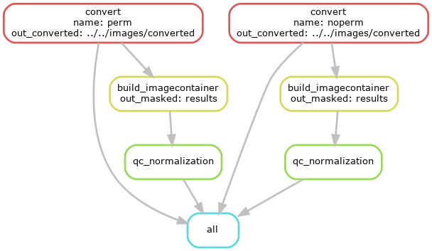
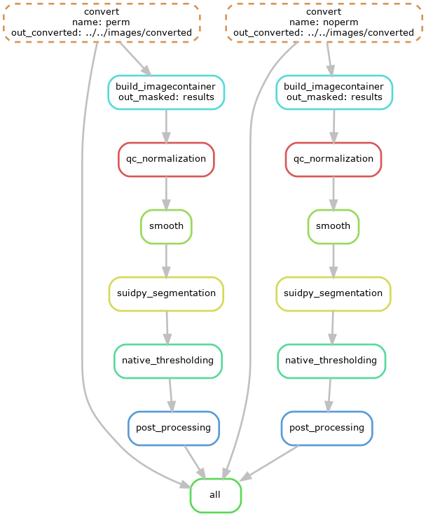

# squidpy_masking

This repository is designed to demonstrate fluorescence image masking
for Visium analysis using the 
[squidpy (Palla, Spitzer et al., 2022)](https://www.nature.com/articles/s41592-021-01358-2) 
package in Python.

## Package installation

Packages were installed using the [Conda](https://docs.conda.io/en/latest/) package manager.
For more detailed information about packages and versions, refer to 
the `env.archived.yaml` file.

## Workflow

1. **Image Loading**

- Scenario 1: Loading demo images using `squidpy.datasets.visium_fluo_image_crop`.
- Scenario 2: Loading `tif` and `tiff` images converted from the `vsi` format, 
taken using the Olympus VS200 scanner.

2. **Smoothing**: Apply [Gaussian smoothing](https://en.wikipedia.org/wiki/Gaussian_blur) 
with `squidpy.im.process` to reduce noise.  

3. **Thresholding and segmentation**: Generate foreground masks using Otsu,
   adaptive/local thresholding, or Squidpy-derived binary masks, then optionally
   run watershed segmentation on cleaned masks.

4. **Post-processing**: Clean foreground masks with configurable fixed,
   adaptive, or pass-through behavior. Adaptive cleaning estimates per-channel
   connected-component statistics, selects a minimum object size, optionally
   applies conservative morphology, writes `cleaning_summary.tsv`, and preserves
   the final binary mask as `image_removal`.

5. **Visualization**: Compare pre/post-smoothing, thresholding, cleaning, and
   segmentation results.

6. **Channel merge**: Merge channels of interest.

## Scripts

### Individual demo scripts

- `scripts/individual/segmentation.Rmd`: Masking demo fluorescence images from 
`squidpy.datasets.visium_fluo_image_crop`.
- `scripts/individual/image_conversion_<sample>.Rmd`: Converting user images from `vsi` to `tif` 
using the `bftools` package.
- `scripts/individual/segmentation_<sample>_<dimension>.Rmd`: masking `tif` fluorescence images 
using Squidpy’s default segmentation workflow (Otsu thresholding and Watershed 
segmentation) with different cropping dimensions
- `scripts/individual/segmentation_<sample>_<dimension>_adaptive.Rmd`: masking `tif` fluorescence
images using adaptive thresholding and erosion with different cropping dimensions
- `scripts/individual/segmentation_<sample>_<dimension>_adaptive_eq.Rmd`: input image
preprocessed with adaptive equalization before smoothing

### Snakemake wrappers

- `scripts/snakemake/Snakefile`: Running Snakemake pipeline with 
config-dependent stopping points
- `scripts/snakemake/config/config.yaml`: Configuring Snakemake, including
the active sample table path, dynamic chunk-size settings
(`chunk_ratio`/`chunk_size`), review-stop options (`norm_method: ""` stops
after `qc_normalization`; `thresholding: ""` stops before `post_processing`),
and adaptive cleaning parameters.
- `scripts/snakemake/config/sampletable.txt`: Example sample table specifying
sample names and corresponding input image paths. The active table is selected
with `sampletable` in `config.yaml`. Specify the `channel` column as `single`
(non-fluorescence) or `multi` (fluorescence) for each input image; only `multi`
samples are processed through masking, QC, and segmentation targets.
- `scripts/snakemake/image_conversion.Rmd`: 
Wrapper script running `bftools` for image conversion
- `scripts/snakemake/build_imagecontainer.Rmd`: 
Wrapper script building an `ImageContainer` object of Squidpy from the `tif` image,
optionally crops the image, and saves it as a `zarr` file.
- `scripts/snakemake/qc_normalization.Rmd`: Wrapper script normalizing input image
intensities. Currently three normalization methods are applied in parallel: 
Contrast Limited Adaptive Histogram Equalization (CLAHE), log1p transformation,
and percentile rescaling. Both images and intensity histograms are saved and
rendered in the HTML report.
- `scripts/snakemake/smooth.Rmd`: Wrapper script conducting Gaussian smoothing
- `scripts/snakemake/squidpy_segmentation.Rmd`: Wrapper script conducting global 
thresholding (Otsu) and watershed segmentation using the Squidpy's default 
functionality, global thresholding conducted by chunk
- `scripts/snakemake/native_thresholding.Rmd`: Wrapper script conducting global
 (Otsu) thresholding and adaptive (local) thresholding, using native functions
 from the `scikit-image` and `dask_image` packages
- `scripts/snakemake/post_processing.Rmd`: Wrapper script cleaning selected
threshold masks with configurable `cleaning_mode` (`fixed`, `adaptive`, or
`off`) and `morphology_mode` (`fixed`, `adaptive`, or `off`). It estimates
adaptive parameters globally per sample/channel, writes `cleaning_summary.tsv`,
keeps the final binary mask as `image_removal`, and keeps `image_dilation` when
morphology is run for visual review.
- `scripts/snakemake/watershed_segmentation.Rmd`: Wrapper script for labeling
foreground objects using watershed segmentation on the cleaned `image_removal`
mask.
- `scripts/snakemake/merge_channels.Rmd`: Wrapper script for merging
channels of interest.

