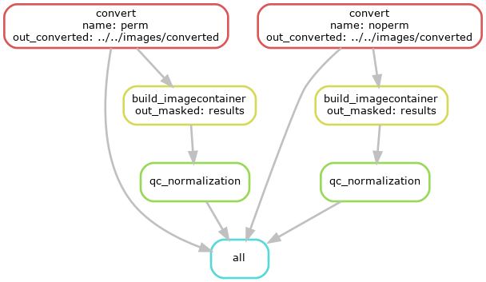

# squidpy_masking

This repository is designed to demonstrate fluorescence image masking
for Visium analysis using the 
[squidpy (Palla, Spitzer et al., 2022)](https://www.nature.com/articles/s41592-021-01358-2) 
package in Python.

## Package installation

Packages were installed using the [Conda](https://docs.conda.io/en/latest/) package manager.
For more detailed information about packages and versions, refer to 
the `env.archived.yaml` file.

## Workflow

1. **Image Loading**

- Scenario 1: Loading demo images using `squidpy.datasets.visium_fluo_image_crop`.
- Scenario 2: Loading `tif` and `tiff` images converted from the `vsi` format, 
taken using the Olympus VS200 scanner.

2. **Smoothing**: Apply [Gaussian smoothing](https://en.wikipedia.org/wiki/Gaussian_blur) 
with `squidpy.im.process` to reduce noise.  

3. **Segmentation**: Segment images using the following approaches
   - [Otsu thresholding](https://en.wikipedia.org/wiki/Otsu's_method)
   - [Watershed segmentation](https://en.wikipedia.org/wiki/Watershed_(image_processing))
   - [Adaptive thresholding](https://scikit-image.org/docs/0.25.x/auto_examples/applications/plot_thresholding_guide.html#local-thresholding)

4. (Optional) **Additional processing**:
   - [Adaptive equalization](https://en.wikipedia.org/wiki/Adaptive_histogram_equalization)
   - [Erosion](https://en.wikipedia.org/wiki/Erosion_(morphology))

5. **Visualization**: Compare pre/post-smoothing and pre/post-segmentation results.  

6. **Channel merge**: Merge channels of interest

## Scripts

### Individual demo scripts

- `scripts/individual/segmentation.Rmd`: Masking demo fluorescence images from 
`squidpy.datasets.visium_fluo_image_crop`.
- `scripts/individual/image_conversion_<sample>.Rmd`: Converting user images from `vsi` to `tif` 
using the `bftools` package.
- `scripts/individual/segmentation_<sample>_<dimension>.Rmd`: masking `tif` fluorescence images 
using Squidpy’s default segmentation workflow (Otsu thresholding and Watershed 
segmentation) with different cropping dimensions
- `scripts/individual/segmentation_<sample>_dimension>_adaptive.Rmd`: masking `tif` fluorescence
images using adaptive thresholding and erosion with different cropping dimensions
- `scripts/individual/segmentation_<sample>_dimension>_adaptive_eq.Rmd`: input image 
preprocessed with adaptive equalization before smoothing

### Snakemake wrappers

- `scripts/snakemake/Snakefile`: Running Snakemake pipeline to convert `vsi` to `tif`
- `scripts/snakemake/config/config.yaml`: Configuring Snakemake
- `scripts/snakemake/config/sampletable.txt`: 
Specifying sample names and corresponding input image paths
- `scripts/snakemake/image_conversion.Rmd`: 
Wrapper script running `bftools` for image conversion
- `scripts/snakemake/build_imagecontainer.Rmd`: 
Wrapper script building an `ImageConainer` object of Squidpy from the `tif` image
with and without adaptive equalization
- `scripts/snakemake/qc_normalization.Rmd`: Wrapper script normalizing input image
intensities. Currently three normalization methods are applied in parallel: 
Contrast Limited Adaptive Histogram Equalization (CLAHE), log1p transformation,
and percentile rescaling.
- `scripts/snakemake/smooth.Rmd`: Wrapper script conducting Gaussian smoothing
- `scripts/snakemake/squidpy_segmentation.Rmd`: Wrapper script conducting global 
thresholding (Otsu) and watershed segmentation using the Squidpy's default 
functionality, global thresholding conducted by chunk
- `scripts/snakemake/native_thresholding.Rmd`: Wrapper script conducting global
 (Otsu) thresholding and adaptive (local) thresholding, using native functions
 from the `scikit-image` and `dask_image` packages
- `scripts/snakemake/post_processing.Rmd`: Wrapper script performing erosion,
dilation, and removal of small foreground objects to clean noisy non-cell
speckles, using native functions from ``dask_image`` and ``scikit-image``.
- `scripts/snakemake/watershed_segmentation.Rmd`: Wrapper script for labeling
foreground objects using the Wathershed segmentation by relying on the 
wrapper function from Squidpy.

